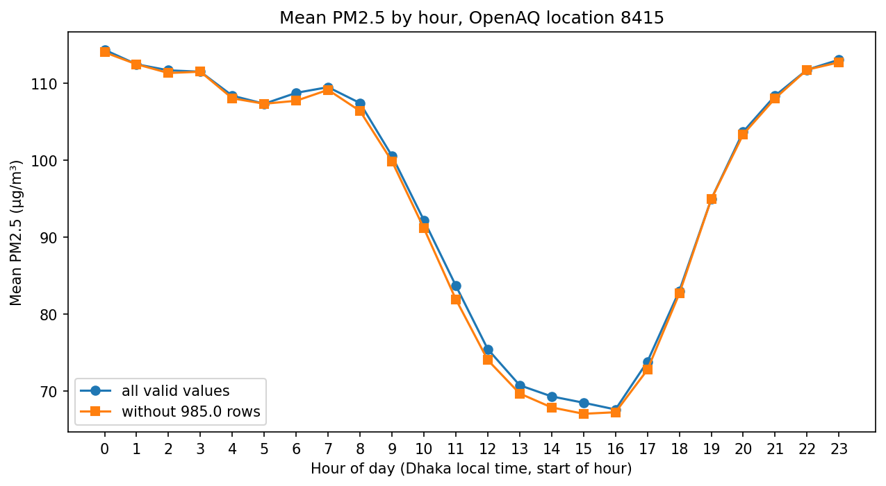

# Dhaka Air Quality EDA: hourly PM2.5 patterns and weather association

## Problem
How does PM2.5 at one air-quality monitor in Dhaka vary by hour of day, weekday/weekend, month, and weather, and how complete is the record?

## Objective
Exploratory data analysis only (no prediction model). Describe patterns in the data and state clearly what the data can and cannot support.

## Dataset
**PM2.5:** OpenAQ location 8415 "Dhaka" (AirNow reference monitor, provider AirNow), sensor 24434, hourly, ug/m3, time zone Asia/Dhaka (UTC+06:00). The file has columns value, from_utc, to_utc, from_local, to_local. Each row covers one hour. OpenAQ labels the data "US Public Domain", but the owner of this dataset is not verified. The raw CSV is not included in this repository.

**Weather:** Open-Meteo Historical Weather API, models=era5 (ERA5 reanalysis, a model-based estimate that combines observations with a weather model; it is not station measurements). Variables: temperature_2m (C, instant), rain (mm, sum of the preceding hour), wind_speed_10m (km/h, instant), time zone Asia/Dhaka, 2016-11-09 to 2025-03-25. The grid-cell centre is 23.75, 90.5, roughly 9 km from the monitor (23.796374, 90.424614). 73,416 hourly rows, no missing values. Data: Open-Meteo (CC BY 4.0 per its website); cite Zippenfenig (2023), doi:10.5281/zenodo.7970649, and Hersbach et al. (2023), ERA5 hourly data on single levels, doi:10.24381/cds.adbb2d47. Contains modified Copernicus Climate Change Service information.

## Tools
Python, pandas, matplotlib, Kaggle notebook. The four analysis scripts and download_weather.py use only the Python standard library.

## Methodology and decisions
- Time: Dhaka local time (from_local, UTC+06:00); each hour is labelled by the start of its interval.
- Blank values and hours with no row are left out of every mean (not treated as zero).
- 43 rows equal exactly 985.0. It is not known whether this is real, a cap or an error code, so they are kept in the main results and each key result is also checked without them.
- Weekend = Friday and Saturday (an assumption about Bangladesh, not from the data).
- Coverage rule for month comparisons: year-months with at least 75% of hourly slots holding a number (83 of 101 pass). The cutoff is arbitrary.
- Weather merge: temperature and wind at the hour start; rain uses the next timestamp (the preceding-hour sum), so it covers the same hour as the PM2.5 reading.

## Data quality
- 66,379 rows; 61,229 have a number; 5,150 are blank; start times are unique.
- First start 2016-11-09 17:00 UTC (23:00 local), last start 2025-03-24 12:00 UTC (18:00 local). 73,364 hourly slots in that span; 6,985 have no row (1,426 separate gaps). Together with blanks, 12,135 hours (about 16.5%) have no usable number. The cause is unknown.
- Percent of expected hourly slots with a number by year: 2016 94.6 (partial), 2017 75.1, 2018 57.0, 2019 91.9, 2020 90.1, 2021 83.0, 2022 86.7, 2023 83.8, 2024 94.9, 2025 99.2 (partial).
- Months with the lowest coverage: Oct 2018 (0 of 744 hours), Sep 2018 (4 of 720), Feb 2023 (11.8%), Dec 2017 (21.4%), Mar 2023 (36.3%).
- Values range from 0.0 to 985.0, mean 96.14, median 68, standard deviation 84.51 (right-skewed).

## Results (all pooled over 2016-2025, association only)

- **Hour of day:** the highest mean is at hour 0 (114.36) and the lowest at hour 16 (67.57). Without the 985.0 rows the lowest moves to hour 15 (67.01 vs 67.21 at hour 16).
- **Weekday vs weekend:** mean 97.64 on weekdays and 92.32 on weekends (medians 70 and 65), a small difference compared with the spread of the data.
- **Month:** January has the highest mean (198.98) and July the lowest (34.77). The seasonal shape is the same with all months, without the 985.0 rows, and under the 75% coverage rule. Removing the 985.0 rows changes July to September most (August 40.56 to 36.51).
- **Rain:** hours with rain have a mean of 45.97 vs 110.50 without rain. Within single months the gap is much smaller, and in July and August the two are similar.
- **Temperature (quartiles):** means of 184.93, 90.18, 54.59 and 52.84 from the coldest to the warmest quarter of hours.
- **Wind (quartiles):** 110.58, 121.20, 108.25 and 44.20 from the calmest to the windiest quarter; only the top group is low.

## Limitations
- One station; it cannot represent all of Dhaka.
- Association is not causation. Temperature, rain and PM2.5 all follow the season, so the weather results partly reflect the seasonal pattern.
- Weather is a model-based grid-cell estimate about 9 km away, not a measurement at the monitor.
- Coverage differs by year and month, and results are pooled across years.
- Weekend definition and the 75% rule are choices, not facts about the data.
- No pollution sources, health effects or forecasting are analysed.

## Future work
Year-by-year comparisons under the coverage rule, a closer look at the 985.0 values, and a special-period comparison only if the data supports it.

## How to run
1. The hourly PM2.5 data comes from OpenAQ (location 8415, sensor 24434, an AirNow reference monitor). OpenAQ labels this data as US Public Domain; the data owner was not independently verified, so please credit OpenAQ as the source. The data was downloaded once through the OpenAQ API and saved as `data/raw/pm25_sensor_24434.csv` (git-ignored, so it is not in this repository). To reproduce the analysis, obtain the same CSV from OpenAQ and save it at that path.
2. The four scripts (data_check.py, find_empty.py, yearly_missing.py, monthly_grid.py) read that file and print the counts above: python data_check.py
3. download_weather.py downloads the weather CSV from Open-Meteo (no key needed) and saves it as data/raw/weather_era5_dhaka.csv.
4. The analysis is in notebooks/dhaka_pm25_eda.ipynb, which expects the PM2.5 CSV and the weather CSV as Kaggle inputs.
